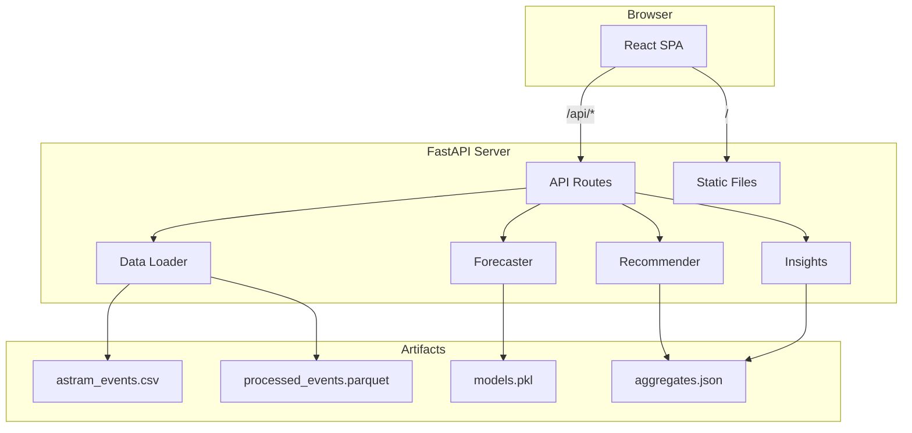

# EventFlow Architecture

## System Overview

## Data Pipeline

1. **Raw CSV** (`data/astram_events.csv`) — 8,173 anonymized Astram records
2. **Preprocess** (`backend/scripts/preprocess.py`)
   - Parse datetimes, validate Bangalore geofence
   - Derive `duration_minutes`, `impact_score`, temporal features
3. **Train** (`backend/scripts/train_models.py`)
   - Random Forest regressors for impact + duration
   - Random Forest classifier for road closure
   - Precompute aggregates for insights + recommendations
4. **Artifacts** committed to `backend/artifacts/` for fast cold starts

## Forecasting Logic

Features: event type/cause, corridor, zone, junction, police station, lat/lng, hour, day-of-week, weekend flag, corridor density, planned duration.

Outputs blended with historical `(cause, corridor)` lookup when similar events exist.

## Recommendation Logic

Rule engine layered on forecast:

- **Manpower** — tier-based (Low/Medium/High/Critical) + corridor density bonus
- **Barricades** — closure probability + cause flags (procession, VIP)
- **Diversions** — nearest corridors with lower historical incident density
- **Timeline** — cause-specific deploy windows (T-90 for rallies, T-30 for construction)

## Deployment

Single Docker container:

1. Install Python + Node
2. Train models (or use committed artifacts)
3. Build React frontend → `backend/static/`
4. Run `uvicorn` serving API + SPA

Render Blueprint: [`render.yaml`](../render.yaml)
